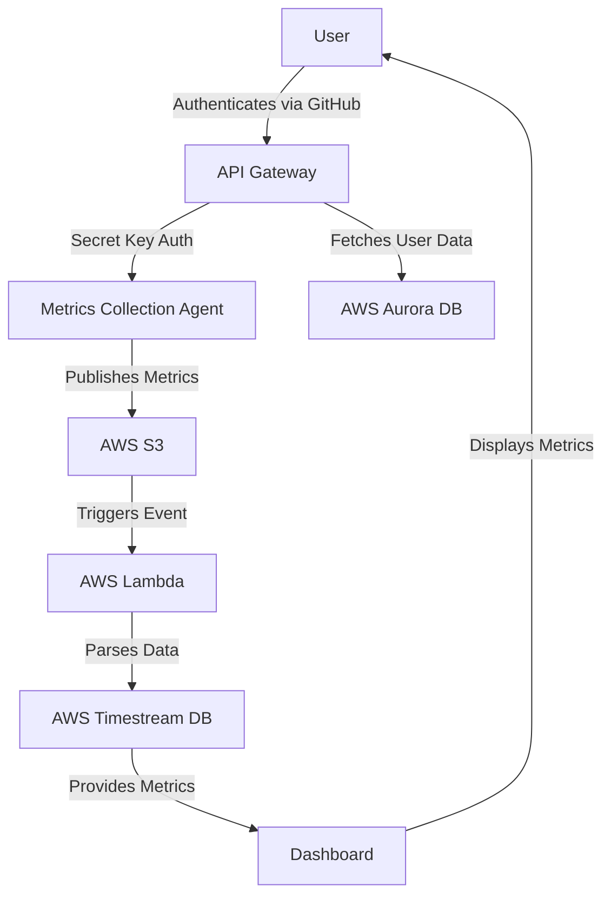

# Timeseries Metrics Saas Service



## Overview
The Timeseries Metrics SaaS Service is designed to collect and display performance metrics from systems. It allows users to monitor CPU utilization, memory usage, and disk usage through a user-friendly dashboard.

## Features
- **Metrics Collection**: 
  - Collects CPU utilization, memory usage, and disk usage from Linux-based operating systems.
  - Metrics are published to AWS S3 every minute.
  
- **Data Processing**: 
  - AWS Lambda functions parse the data and store it in AWS Timestream DB.
  
- **Dashboard**: 
  - Displays time series metrics as graphs.
  - Built using React, styled with Tailwind CSS and DaisyUI.
  - Updates in near real-time.

- **Authentication**: 
  - API is serverless and utilizes AWS API Gateway.
  - Secret key-based authentication for the metrics collection agent.
  - User authentication via GitHub.

## Architecture
- **Infrastructure**: 
  - AWS services including S3, Lambda, Timestream DB, and Aurora DB.
  
- **Agent**: 
  - A GoLang executable binary that users can download and deploy on their systems.

## Getting Started
### Prerequisites
- AWS account
- GoLang installed for building the agent
- Node.js and npm for the dashboard

### Installation
1. **Download the Metrics Collection Agent**:
   - [Link to download the agent]

2. **Deploy the Agent**:
   - Follow the installation instructions provided in the agent documentation.

3. **Set Up the Dashboard**:
   - Clone the repository:
     ```bash
     git clone [repository-url]
     cd [repository-directory]
     ```
   - Install dependencies:
     ```bash
     npm install
     ```
   - Start the development server:
     ```bash
     npm start
     ```

## Future Enhancements
- Implement thresholds and alerts for metrics.
- Expand support for additional operating systems.
- Enhance user interface and experience.

## Contributing
Contributions are welcome! Please open an issue or submit a pull request for any enhancements or bug fixes.

## License
This project is licensed under the MIT License - see the [LICENSE](LICENSE) file for details.